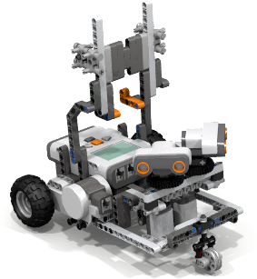

# TourRobot

This is a prototype tele-operated robot and was written by João Alves <jpralves@gmail.com> and was the result of a thesis called *"Mobile Robotic System controlled remotely via the Internet"*. 

My web address is <http://jpralves.net>

## Licensing

All the files created by me in the project are under the [GPLv3 license](docs/gpl_3.0.txt). 
The changed or used files from other sources retain the original license and my contributions are made on those files under their licenses.

## Abstract

Today, with the spread of means of data telecommunications based on Internet, it is virtually possible to act or give instructions remotely to any equipment which has the interface for it. Some solutions have been developed to take advantage of this potential, however the vast majority involves simple interactions such as turning on lights through the home automation system or acting on equipment of the environmental control systems remotely monitoring them or changing their parameters. The aim of this thesis is to demonstrate that it is possible to go beyond these simple interactions, using low-cost systems and simple implementation, enabling the creation of a robotic system that not only has the ability to obeying the move commands of the remote operator, as it ensures
that avoids obstacles, and allows the operator to watch through the video the environment where the robot is. Such a solution could be used in the real estate business for showing remotely a house allowing a virtual tour controlled by the interested buyer. During the writing of this thesis it was built a prototype using the [LEGO Mindstorms NXT] kit, and an Android smart-phone.

## Introduction

TourRobot is a prototype tele-operated robot. The work was developed by João Alves (<jpralves@gmail.com>) and was the result of a thesis called *"Mobile Robotic System controlled remotely via the Internet"*.

This prototype has three modules that run on three different architectures. The modules are named [NXTSlave], [NXTController] and [NXTBrowser].
The first, [NXTSlave] is built using [leJOS] and runs on a [LEGO Mindstorms NXT] robot.
The second, [NXTController] is an Android application.
The last is [NXTBrowser] and run on a modern Browser.

## Features

- Capacity to control an [LEGO Mindstorms NXT] robot using an Android smartphone.
- Remotely control the robot using a browser.
- Use the Android camera to capture video and send it remotely to a Browser.
- Programming robot with avoid objects behavior.
- Dynamically register IP Addresses to give site urls instead of numbered urls.

## Compiling the source code

The development of the prototype was made using [Eclipse]. You can import the project to [Eclipse] and compile it.
Requirements:
- [leJOS plugin] for [NXTSlave];
- [ADT plugin] for [NXTController].

These plugins can be installed in [Eclipse] using the following steps:
1. Goto Help > Install New Software....
2. Click Add, in the top-right corner.
3. In the Add Repository dialog that appears, enter "leJOS plugin" or "ADT plugin" for the Name and the URL above at the Location.

## NXTSlave module

This module was developed for [leJOS] and to run it you need to replace the firmware on the NXT by the one that comes with [LeJOS].
The instructions for assembling the robot are [here](docs/build/). They are in [PDF](docs/build/TourRobot-building-instructions.pdf) format and in [LXF](docs/build/TourRobot.lxf) format for [LDD].
This module has some defined behaviors to prevent the operator to break or to damage the robot.

Source code is [here][NXTSlave].

## NXTController module

The application that runs on Android has several hardware requirements. This requirements are:
- Interface Bluetooth - this is a requirement for the communications with [NXTSlave];
- Wireless LAN — required to communicate with the operator;
- Back Camera - to capture video;
- Minimum operating system Android 2.3 - Gingerbread (API level 9) or higher.

The [NXTController] coomunicates with the [NXTSlave] with bluetooth and you must pair the devices prior to using them.
There is an interface to operate the robot on the Android that can be used to control the robot movements.
In the main interface when the "Connect" button is pressed the application tries to connect with the NXT, that must be running in [NXTSlave] already, and
starts the embeded webserver.
If the Android smartphone has a public IP Address it will try to register in the [Dynamic Register Server][DynReg].
Alternatively if you have the Android smartphone connected to your wireless network you can configure the router to allow an inbound port connection to the IP of the Android and define it in the Webserver NAT Port setting under the Webserver Preferences. This is not a requirement you can simply use the private IP address in the Browser.

Source code is [here][NXTController].

## NXTBrowser module

This module is made of HTML, CSS, Bitmaps and Javascript and is built in the [NXTController] module and downloaded when the Browser accesses the [NXTController] web server.
To access this module you must write in the browser the address that appears in the Android Application when you press the button *"Connect"*.
If you want to use the [Dynamic Register][DynReg] feature to use a server named instead of an IP Address.
The system has a password enabled system to prevent unauthorized access. You must define a **password** in the [NXTController] module to access the interface.

Source code is [here][NXTBrowser].

## Dynamic Register module

This small module enables [NXTController] to register its public address in an Internet server. It requires that the server where it is run has [PHP] and a [MySQL] <http://www.mysql.com/> database. The database configuration must be defined in the `config.php` file. You must create the table in the database with the commands in the file `sqltable.sql`.

Source code is [here][DynReg].

There is also an additional parameter named **sitekey** that must match to the one defined in the preferences of [NXTController] module.

# Version History
- 1.00 (2013-04-30): first published version

## Packages used
For the embedded webserver in the [NXTController] I've used [NanoHTTPD].
In the [NXTBrowser] I've used [jQuery] 1.9.1, [jQuery Timer](http://jchavannes.com/jquery-timer/demo), [jQuery Image Loader](https://github.com/Gaya/QueryLoader2), [jQuery lang](https://github.com/coolbloke1324/jquery-lang-js), and the buttons use a [style](http://nicolasgallagher.com/lab/css3-github-buttons/).

[NXTController]: NXTController/
[NXTSlave]: NXTSlave/
[NXTBrowser]: NXTBrowser/
[DynReg]: DynReg/
[LEGO Mindstorms NXT]: http://mindstorms.lego.com/en-us/default.aspx
[leJOS]: http://lejos.sourceforge.net/
[leJOS plugin]: http://lejos.sourceforge.net/tools/eclipse/plugin/nxj/
[ADT plugin]: https://dl-ssl.google.com/android/eclipse/
[jQuery]: http://jquery.com/
[NanoHTTPD]: http://elonen.iki.fi/code/nanohttpd/
[MySQL]: http://www.mysql.com/
[PHP]: http://php.net/
[Eclipse]: http://www.eclipse.org/
[LDD]: http://ldd.lego.com/

